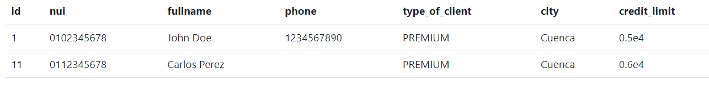

En base a las tablas del diagrama adjunto, generar las siguientes consultas usando las sentencias vistas en clase.

1) Contar el número de productos de una categoría específica.
SELECT category, COUNT(*) AS product_count
FROM products
GROUP BY category;

2) Contar el número de clientes en una ciudad específica.
SELECT city, COUNT(*) AS customer_count
FROM client
GROUP BY city;

3) Contar el número de productos cuyo precio está dentro de un rango específico 
SELECT COUNT(*) AS product_count
FROM product
WHERE price BETWEEN 300 AND 800;

4) Seleccionar clientes que viven en una ciudad específica y tienen un tipo de cliente específico
SELECT *
FROM client
WHERE city = 'Cuenca' AND type_of_client = 'PREMIUM';

5) Seleccionar productos que pertenecen a una categoría específica y cuyo precio está por encima de un valor específico
SELECT *
FROM product
WHERE category = 'Audio' AND price > 200;

6) Seleccionar productos que fueron producidos en un año específico y en un país de origen específico
SELECT *
FROM product
WHERE year_of_production = 2023 AND country_of_origin = 'China';

7) Seleccionar clientes cuyo nombre completo comience con 'J'
SELECT *
FROM client
WHERE fullname LIKE 'J%';

8) Seleccionar clientes cuya ciudad contenga la letra 'a'
SELECT *
FROM client
WHERE city LIKE '%a%';
